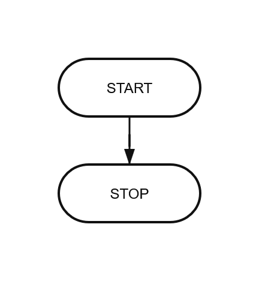
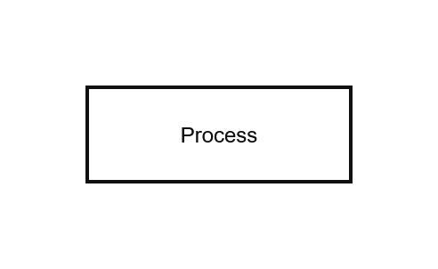
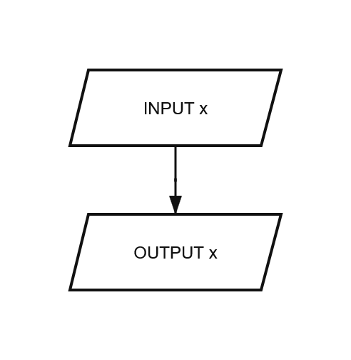
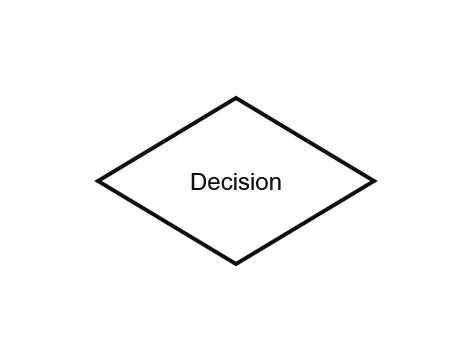
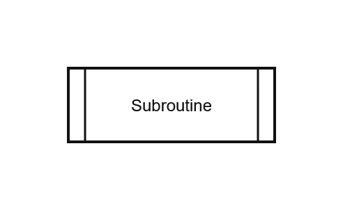
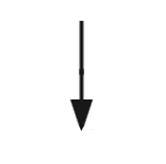
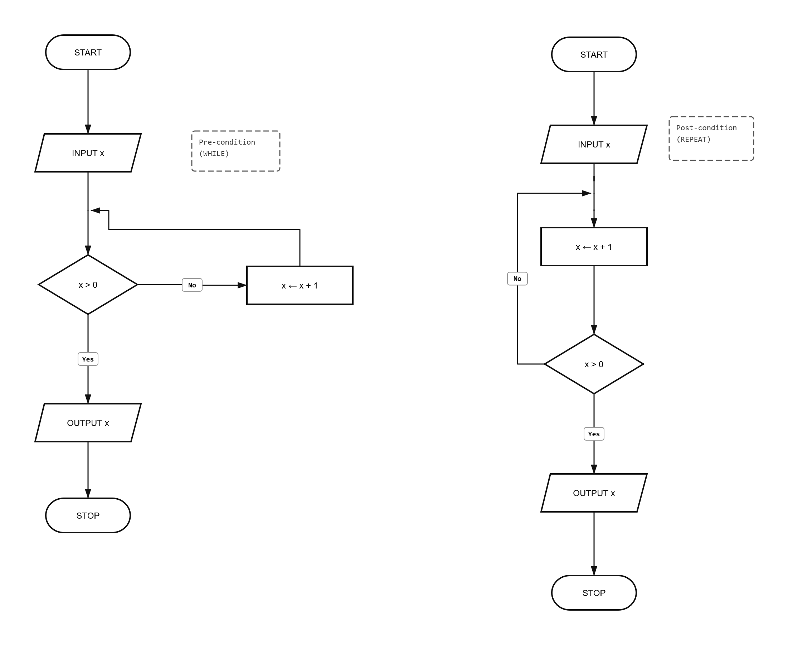

# Cambridge Algorithms: Structure Diagrams & Flowcharts

This guide explains the visual methods used to design and represent algorithms for Cambridge IGCSE and AS & A Level Computer Science.

---

## 1. Structure Diagrams
A structure diagram is a hierarchical, top-down design tool used to break a complex problem into smaller, manageable sub-problems (decomposition).

* **Top Level**: The main system or overall problem.
* **Sub-systems**: Lower levels represent more detailed tasks.
* **Implementation**: Decomposition continues until each box represents a single, simple task that can be written as a subroutine.

"LINK FOR STRUCTURE DIAGRAM EXAMPLE HERE"

---

## 2. Flowchart Symbols
Flowcharts use specific shapes to represent different types of instructions. Standardized symbols ensure the logic is universally understood.

| Symbol | Name | Description |
| :--- | :--- | :--- |
|  | **Terminator** | Represents the **START** and **STOP** of an algorithm. |
|  | **Process** | Used for internal operations like assignments or calculations (e.g., `Count ← Count + 1`). |
|  | **Input / Output** | Represents data entering the system (`INPUT`) or being displayed (`OUTPUT`). |
|  | **Decision** | A diamond shape used for `IF` conditions or loops. Usually has two exits: **Yes** and **No**. |
|  | **Subroutine** | Represents a call to a separate procedure or function. |
|  | **Flow Line** | Arrows that show the direction of the program flow. |

---

## 3. Representing Control Structures

### Selection (IF Statements)
In a flowchart, selection is shown using a Decision diamond. One path is followed if the condition is True, and another if it is False.


### Iteration (Loops)
Loops are created by drawing a flow line that points back to an earlier part of the flowchart.
* **Pre-condition (WHILE)**: The decision diamond appears *before* the process.
* **Post-condition (REPEAT)**: The decision diamond appears *after* the process.



---

## 4. From Flowchart to Pseudocode
A common exam task is to "translate" a flowchart into pseudocode.

**Example Logic:**
1.  **Start** (Terminator)
2.  **Input** `Score` (Input/Output)
3.  **Is `Score > 50`?** (Decision)
    * **Yes**: Output "Pass"
    * **No**: Output "Fail"
4.  **Stop** (Terminator)

**Equivalent Pseudocode:**
```pseudocode
INPUT Score
IF Score > 50 THEN
    OUTPUT "Pass"
ELSE
    OUTPUT "Fail"
ENDIF
```

---

## 5. Benefits of Visual Design
* **Clarity**: Easier to see the "big picture" of the logic compared to lines of text.
* **Communication**: Can be understood by non-programmers or stakeholders.
* **Error Finding**: Easier to spot infinite loops or missing logic paths (e.g., a decision diamond with only one exit line).
