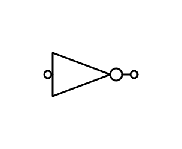
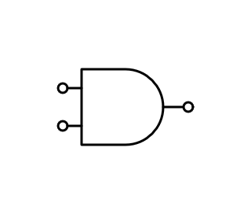
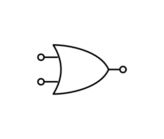
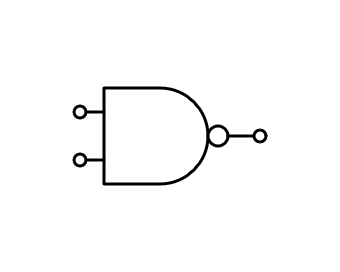
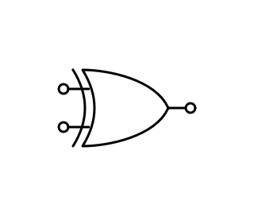

# Cambridge Boolean Logic & Logic Gates Guide

This guide covers the logic gates, truth tables, and Boolean expressions required for Cambridge IGCSE (0478/0984) and AS & A Level (9618) Computer Science.

## 1. Fundamentals of Boolean Logic
In computer science, logic is based on two states:
* **True** (1 / High / On)
* **False** (0 / Low / Off)

Logic gates are the physical or virtual components that process these binary inputs to produce a single output.

---

## 2. Standard Logic Gates

### NOT Gate (Inverter)
The output is always the opposite of the input.
* **Expression**: `X = NOT A`
* **Truth Table**:
| Input A | Output X |
| :--- | :--- |
| 0 | 1 |
| 1 | 0 |

### AND Gate
The output is True only if **both** inputs are True.
* **Expression**: `X = A AND B`
* **Truth Table**:
| A | B | X |
| :--- | :--- | :--- |
| 0 | 0 | 0 |
| 0 | 1 | 0 |
| 1 | 0 | 0 |
| 1 | 1 | 1 |

### OR Gate
The output is True if **at least one** input is True.
* **Expression**: `X = A OR B`
* **Truth Table**:
| A | B | X |
| :--- | :--- | :--- |
| 0 | 0 | 0 |
| 0 | 1 | 1 |
| 1 | 0 | 1 |
| 1 | 1 | 1 |

### NAND Gate (Not AND)
The opposite of an AND gate. The output is False only if **both** inputs are True.
* **Expression**: `X = A NAND B` or `X = NOT(A AND B)`
* **Truth Table**:
| A | B | X |
| :--- | :--- | :--- |
| 0 | 0 | 1 |
| 0 | 1 | 1 |
| 1 | 0 | 1 |
| 1 | 1 | 0 |

### NOR Gate (Not OR)
The opposite of an OR gate. The output is True only if **both** inputs are False.
* **Expression**: `X = A NOR B` or `X = NOT(A OR B)`
* **Truth Table**:
| A | B | X |
| :--- | :--- | :--- |
| 0 | 0 | 1 |
| 0 | 1 | 0 |
| 1 | 0 | 0 |
| 1 | 1 | 0 |

### XOR Gate (Exclusive OR)
The output is True if the inputs are **different**.
* **Expression**: `X = A XOR B`
* **Truth Table**:
| A | B | X |
| :--- | :--- | :--- |
| 0 | 0 | 0 |
| 0 | 1 | 1 |
| 1 | 0 | 1 |
| 1 | 1 | 0 |

---

## 3. Logic Expressions and Order of Precedence
When dealing with complex logic circuits, expressions are written using brackets to define the order of operations.

**Order of Precedence:**
1. Brackets `( )`
2. `NOT`
3. `AND`
4. `OR`

**Example Expression:**
`X = (A AND B) OR (NOT C)`
* This means the circuit first performs `A AND B` and `NOT C` separately, then feeds both results into an `OR` gate.

---

## 4. Constructing Truth Tables for Circuits
To solve a complex circuit with three inputs (A, B, C):
1.  List all 8 possible combinations of binary inputs (000 to 111).
2.  Create "Intermediate" columns for each gate in the circuit.
3.  Calculate the final output column step-by-step.

| A | B | C | Intermediate (A AND B) | Final Output |
| :--- | :--- | :--- | :--- | :--- |
| 0 | 0 | 0 | 0 | ... |
| 0 | 0 | 1 | 0 | ... |

---

## 5. Summary Table of Notation

| Operation | Logic Expression | Alternative Symbols (Advanced) |
| :--- | :--- | :--- |
| **NOT** | `NOT A` | `¬A` or `Ā` |
| **AND** | `A AND B` | `A . B` |
| **OR** | `A OR B` | `A + B` |
| **XOR** | `A XOR B` | `A ⊕ B` |
